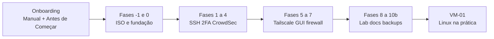

# 🛡️ Sentinela Proxmox – VERSÃO 1.0 (canônica)

-blue)


[](https://creativecommons.org/licenses/by-sa/4.0/)

Curso open-source em português para montar um **homelab Proxmox VE 9.x** endurecido: rede fixa, SSH com chave e 2FA, CrowdSec, Tailscale, firewall `proxmox-firewall`, backups e VM de estudo Linux — **sem expor portas na internet**, com laboratório que você pode partir e recuperar.

**Autor:** Projeto Colaborativo [VIPs-com](https://github.com/VIPs-com)  
**Repositório:** [github.com/VIPs-com/Sentinela-Proxmox-VE-9](https://github.com/VIPs-com/Sentinela-Proxmox-VE-9)  
**Hardware de referência:** mini PC Intel N5095 · 16 GB RAM (funciona em qualquer PVE 9.x compatível).

```bash
git clone https://github.com/VIPs-com/Sentinela-Proxmox-VE-9.git
cd Sentinela-Proxmox-VE-9
```

---

## Jornada do curso



---

## Primeira vez aqui?

| Documento | Para quê |
|-----------|----------|
| **[docs/manual-usabilidade.md](docs/manual-usabilidade.md)** | Estrutura do repo, estágios A–E, roteiro da primeira hora |
| **[docs/INDICE-CURSO.md](docs/INDICE-CURSO.md)** | **§1** — links diretos para cada fase e apêndice |
| **[docs/mapa-do-curso.md](docs/mapa-do-curso.md)** | HOST vs VM vs trilha GPG externa |

---

## Como estudar

Este repositório segue o mesmo modelo do [Zero Trust Core Expert](https://github.com/VIPs-com/Zero-Trust-Core/tree/main): **um arquivo Markdown** com todo o material didático do host.

Abra e estude na ordem:

1. **[🛡️ Sentinela-Proxmox - Versão 1.0.md](🛡️ Sentinela-Proxmox - Versão 1.0.md)** — curso canônico (~6200 linhas), na **raiz** (mesmo modelo do [Zero Trust Core](https://github.com/VIPs-com/Zero-Trust-Core)).
2. Use o **[índice §1](docs/INDICE-CURSO.md)** para pular fases (`Ctrl+Click` no GitHub).

Você pode clonar o repositório, baixar o ZIP ou copiar só os `.md` — **não é obrigatório usar Git** para aprender.

---

## O que você vai construir

Um nó Proxmox **documentado e recuperável**: invisível para scanners na internet (sem port forwarding), acesso remoto via Tailscale, painel web com 2FA, CTs para VPN e lab opcional, e rotina de backup.

| Fase | Ganho principal |
|------|-----------------|
| **-1 · 0** | PVE instalado, IP fixo, NTP, repos, backup `/etc/pve` |
| **1–4** | `sudo`, SSH só chave, 2FA terminal, CrowdSec |
| **5–7** | Tailscale, 2FA GUI, firewall DROP |
| **8–10b** | Lab ShellHub/GPG, updates, diário, vzdump |
| **VM-01** | VM Debian de estudo com snapshot |

Detalhe de cada fase: **[docs/INDICE-CURSO.md](docs/INDICE-CURSO.md)**.

---

## Arquivos do repositório

| Caminho | Aluno? | Conteúdo |
|---------|--------|----------|
| [🛡️ Sentinela-Proxmox - Versão 1.0.md](🛡️ Sentinela-Proxmox - Versão 1.0.md) | Sim | **Curso canônico** (raiz) |
| [docs/INDICE-CURSO.md](docs/INDICE-CURSO.md) | Sim | Índice §1 com links |
| [docs/manual-usabilidade.md](docs/manual-usabilidade.md) | Sim | Manual de uso |
| [docs/mapa-do-curso.md](docs/mapa-do-curso.md) | Sim | Mapa HOST / VM / GPG |
| [docs/README.md](docs/README.md) | Sim | Índice da pasta `docs/` |
| [docs/linux-comandos-fundamentos.md](docs/linux-comandos-fundamentos.md) | Sim | Cheat sheet em VMs |
| [scripts/](scripts/) | Pós-curso | Health-check, Telegram, systemd |

---

## Trilha integrada VIPs-com

| Curso | Repositório |
|-------|-------------|
| **[Sentinela Proxmox](https://github.com/VIPs-com/Sentinela-Proxmox-VE-9)** (este) | Homelab PVE endurecido |
| **[Zero Trust Core Expert](https://github.com/VIPs-com/Zero-Trust-Core)** | KeePassXC, OpenPGP air-gap, backup 3-2-1-1-0 |

Recomendado combinar Sentinela (infra) + Zero Trust Core (segredos e identidade) após a **Fase 8**.

---

## Filosofia

> **Fundamentos antes da escala.**

Segurança no **host** primeiro. Cada fase crítica tem **VERIFIQUE** e **SE DEU ERRADO**.

---

## Avisos

- Laboratório pessoal — não substitui suporte Proxmox enterprise.
- **Nunca** faça commit de chaves, `authorized_keys` ou dumps de `/etc/pve`.
- `proxmox-firewall` (nftables): *tech preview* na [wiki Proxmox — Firewall](https://pve.proxmox.com/wiki/Firewall#nftables).

---

## Licença

**CC BY-SA 4.0** — [LICENSE](LICENSE) · [resumo](https://creativecommons.org/licenses/by-sa/4.0/)

---

*Projeto Colaborativo VIPs-com · Sentinela Proxmox v1.0 (canônica)*
