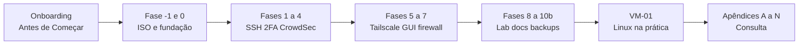

# Manual de uso — Sentinela Proxmox v1.0

**Para quem é:** você abriu o [repositório no GitHub](https://github.com/VIPs-com) ou baixou o ZIP e quer **usar o curso sem se perder** — no mesmo espírito do [Zero Trust Core Expert](https://github.com/VIPs-com/Zero-Trust-Core/tree/master) (um guia principal + manual + índice).

**O que este manual *não* é:** não substitui o [curso canônico](sentinela-proxmox-v1.0.md); é o **GPS** até lá.

---

## Primeira vez aqui?

| Passo | O que fazer | Tempo |
|-------|-------------|-------|
| 1 | Leia o [README da raiz](../README.md) — o que é o projeto e a jornada | 5 min |
| 2 | Abra este manual e identifique seu **estágio** (seção 2) | 2 min |
| 3 | Abra o **[§1 Índice do curso](INDICE-CURSO.md)** em aba fixa — links para cada fase | 1 min |
| 4 | No [curso](sentinela-proxmox-v1.0.md), leia **Antes de Começar** e **Dicas para o aluno** | 15 min |
| 5 | Execute **Fase -1** → **Fase 0** na ordem (use o índice para voltar) | horas |

> **Não é obrigatório usar Git** para estudar — pode ler os `.md` no browser do GitHub ou num editor local.

---

## Como estudar (modelo do curso)

Este repositório segue o mesmo padrão do [Zero-Trust-Core](https://github.com/VIPs-com/Zero-Trust-Core):

| Peça | Arquivo | Função |
|------|---------|--------|
| **Cartão de visita** | [README.md](../README.md) | Visão geral, jornada, licença |
| **Manual de uso** | Este arquivo | Onde você está e o que abrir |
| **Índice §1** | [INDICE-CURSO.md](INDICE-CURSO.md) | Links diretos para cada fase e apêndice |
| **Curso completo** | [sentinela-proxmox-v1.0.md](sentinela-proxmox-v1.0.md) | Um único Markdown com todo o passo a passo |
| **Mapa** | [mapa-do-curso.md](mapa-do-curso.md) | HOST vs VM vs curso GPG externo |
| **Complementos** | [README.md](README.md) (`docs/`) | Matriz, cheat sheet, Telegram opcional |

**Regra:** execute **uma fase de cada vez**, na ordem do índice. Cada fase tem **OBJETIVO**, **FUNDAMENTO**, **COMANDOS**, **VERIFIQUE** e **SE DEU ERRADO**.

---

## Jornada do curso (visão de cima)

---

## 1. Descubra seu estágio (30 segundos)

| Se sua situação for… | Estágio |
|--------------------|---------|
| Não sei se é curso de Linux na VM ou endurecimento do Proxmox no metal | **A** |
| Já entendi que é o host PVE, mas não sei a ordem dos arquivos | **B** |
| Proxmox instalado (ou vou instalar) e quero **executar** passo a passo | **C** |
| Concluí (ou quase) fases 0–10 e quero revisar / automatizar | **D** |
| Quero Telegram ou sync de backup no PC **sem** refazer o curso | **E** |

---

## 2. Estágio A — "O que é isto?"

1. [README](../README.md) da raiz.
2. [mapa-do-curso.md](mapa-do-curso.md) — **HOST** (nó Proxmox) vs **VM** (laboratório) vs **EXT** (GPG/Obsidian).
3. [docs/README.md](README.md) — trilhas 0 a 4.

**Favoritos no browser:** [INDICE-CURSO.md](INDICE-CURSO.md) + [sentinela-proxmox-v1.0.md](sentinela-proxmox-v1.0.md).

---

## 3. Estágio B — "Onde está o curso?"

| Pergunta | Resposta |
|----------|----------|
| Onde está o passo a passo do **host**? | [sentinela-proxmox-v1.0.md](sentinela-proxmox-v1.0.md) |
| Como **pulo** para a Fase 5 ou o Apêndice H? | [INDICE-CURSO.md](INDICE-CURSO.md) |
| O que é a matriz de auditoria? | [audit-matrix.md](audit-matrix.md) — fontes oficiais; **não** é lista de comandos para copiar |
| O que é `docs/interno/`? | Manutenção do projeto — **não** é prova de laboratório |

---

## 4. Estágio C — "Estou executando no lab"

Use o **[índice §1](INDICE-CURSO.md)** como checklist. Resumo por bloco:

| Bloco | Fases | Link índice | Lembrete |
|-------|-------|-------------|----------|
| **A** | -1, 0 | [Fase -1](sentinela-proxmox-v1.0.md#fase-m1) · [Fase 0](sentinela-proxmox-v1.0.md#fase-0) | NTP errado = TOTP falha |
| **B** | 1–2 | [1](sentinela-proxmox-v1.0.md#fase-1) · [2](sentinela-proxmox-v1.0.md#fase-2) | **Duas sessões SSH** antes de `restart` |
| **C** | 3–4 | [3](sentinela-proxmox-v1.0.md#fase-3) · [4](sentinela-proxmox-v1.0.md#fase-4) | Teste TOTP antes de fechar a sessão antiga |
| **D** | 5–6 | [5](sentinela-proxmox-v1.0.md#fase-5) · [6](sentinela-proxmox-v1.0.md#fase-6) | Comandos no **CT 100** vs **host** |
| **E** | 7 | [7](sentinela-proxmox-v1.0.md#fase-7) | ACCEPT antes de DROP |
| **F** | 8 | [8](sentinela-proxmox-v1.0.md#fase-8) | Integra com [Zero Trust Core](https://github.com/VIPs-com/Zero-Trust-Core) (GPG) |
| **G** | 9–10, 10b | [9](sentinela-proxmox-v1.0.md#fase-9) · [10](sentinela-proxmox-v1.0.md#fase-10) · [10b](sentinela-proxmox-v1.0.md#fase-10b) | Nasce `~/sentinela-lab/` |
| **VM** | VM-01 | [VM-01](sentinela-proxmox-v1.0.md#fase-vm-01) | Só depois de SSH estável no host |

**Se travar:** **SE DEU ERRADO** da fase → [Apêndice E — FAQ](sentinela-proxmox-v1.0.md#apendice-e) → [Apêndice H — Recuperação](sentinela-proxmox-v1.0.md#apendice-h).

---

## 5. Estágio D — "Lab fechado (ou quase)"

| Ação | Onde |
|------|------|
| Health-check só-leitura | [scripts/README.md](../scripts/README.md) · `make check` |
| Backups agendados (systemd) | Exemplos em `scripts/systemd/` |
| Cópia para o PC | `scripts/pc/sync-sentinela-backups.example.sh` |

---

## 6. Estágio E — Operação opcional

| Quero… | Documento |
|--------|-----------|
| Alertas Telegram | [monitoramento-telegram.md](monitoramento-telegram.md) |

Ideal **após** Fases 4–7 (CrowdSec, firewall, rede estável).

---

## Roteiro da primeira hora (checklist)

- [ ] Ler [Antes de Começar](sentinela-proxmox-v1.0.md#antes-de-comecar) no guia
- [ ] Bitwarden + app TOTP no celular
- [ ] Cabo Ethernet + acesso físico ao mini PC anotados
- [ ] Abrir [Fase -1](sentinela-proxmox-v1.0.md#fase-m1) e preparar pendrive ISO
- [ ] Anotar no futuro `~/sentinela-lab/diario.md` (criado na Fase 10)

---

## Trilha integrada VIPs-com

| Curso | Foco | Quando encaixa |
|-------|------|----------------|
| **Sentinela Proxmox** (este repo) | Host PVE: rede, SSH, firewall, Tailscale, backups | Primeiro |
| **[Zero Trust Core Expert](https://github.com/VIPs-com/Zero-Trust-Core)** | KeePassXC, VeraCrypt, OpenPGP air-gap, backup 3-2-1-1-0 | Paralelo ou após Fase 8 (GPG) |
| **OpenPGP-GPG do Zero ao Expert** | Criptografia (curso EXT no mapa) | Setor 4 do [mapa-do-curso.md](mapa-do-curso.md) |

---

## Mapa mental (uma frase por arquivo)

| Arquivo | Uma frase |
|---------|-----------|
| [sentinela-proxmox-v1.0.md](sentinela-proxmox-v1.0.md) | O curso — execute no **host** na ordem. |
| [INDICE-CURSO.md](INDICE-CURSO.md) | Atalhos para cada fase (§1). |
| [manual-usabilidade.md](manual-usabilidade.md) | Este GPS. |
| [mapa-do-curso.md](mapa-do-curso.md) | HOST / VM / GPG. |
| [audit-matrix.md](audit-matrix.md) | Por que confiar em cada bloco técnico. |

---

*Sentinela Proxmox v1.0 (canônica) — Projeto Colaborativo VIPs-com*
