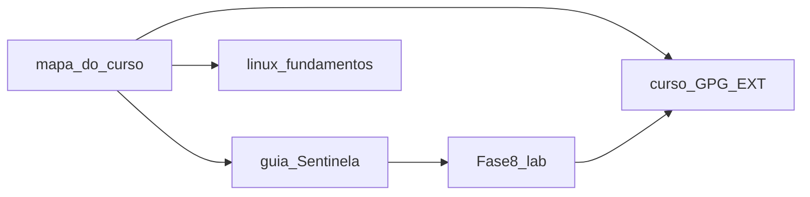

# Mapa do laboratório — visão geral (v1.0)

**Função:** ponto de entrada único para não se perder entre o host Proxmox, as VMs de estudo e o curso GPG/OpenPGP.  
**Guia:** [../🛡️ Sentinela-Proxmox - Versão 1.0.md](../🛡️ Sentinela-Proxmox - Versão 1.0.md) · **Índice §1 (link por fase):** [INDICE-CURSO.md](INDICE-CURSO.md) · **Como usar o repo:** [manual-usabilidade.md](manual-usabilidade.md)

---

## Legenda de trilhas

| Prefixo | Significado |
|---------|-------------|
| **HOST** | Nó Proxmox VE — segue **só** o guia Sentinela (firewall PVE, CrowdSec, Tailscale no CT100, etc.). |
| **VM** | Debian (ou outro) **dentro** de VM/CT de laboratório — cheat sheet e UFW/`fail2ban` quando fizer sentido. |
| **EXT** | Material **fora** deste repositório (Obsidian, outro Git, PDF do professor). |

---

## O que há dentro de `docs/`

Lista **numerada** (trilhas 0 a 4), categorias **núcleo / complemento / operação** e links estáveis: **[README.md desta pasta](README.md)**. Abra esse arquivo sempre que entrar na pasta `docs/` no GitHub ou no disco — evita confundir o guia principal com complementos e operação opcional. **Guia de uso do repo (estágios A–E):** [manual-usabilidade.md](manual-usabilidade.md). Documentação de **manutenção do projeto** (não é exame): [interno/README.md](interno/README.md).

---

## Setor 0 — Onboarding (antes de mexer no host)

**Objetivo:** saber *onde* você vai e com *quais* contas, sem instalar nada às cegas.

- **Resultados esperados (trilha HOST concluída):** nó PVE com rede estável, repos corretos, SSH com chave + 2FA, painel com `renato@pam` + 2FA, CrowdSec, firewall nftables, acesso remoto sem port forwarding (Tailscale), lab do irmão opcional, backups e documentação viva.
- **Perfil:** mini PC (ex.: N5095, 16 GB RAM), homelab — **não** é roadmap de datacenter no dia 1.
- **Checklist de ferramentas:** Bitwarden, app TOTP, cabo Ethernet, acesso físico ao mini PC — ver **Antes de Começar** e **Apêndice G** no [guia Sentinela](../🛡️ Sentinela-Proxmox - Versão 1.0.md).
- **Leituras cruzadas:**
  - [audit-matrix.md](audit-matrix.md) — o que foi confrontado com docs oficiais.
  - [roadmap-hardware.md](roadmap-hardware.md) — evolução N5095 → máquinas mais fortes (opcional).
  - [ProxMenux](https://proxmenux.com/) (opcional) — menu shell; ver aviso de fonte no guia.

---

## Setor 1 — Mapa do curso (você está aqui)

1. Leia o **Setor 0** acima.  
2. Percorra o **Setor 2** na **ordem dos blocos A→G** (é a ordem do guia).  
3. Em paralelo ou depois: **Setor 3** (Linux nas VMs) quando tiver guests de estudo.  
4. **Setor 4** (GPG): curso canônico no seu material **EXT** + prática no homelab na **Fase 8**.



---

<span id="setor-2-host"></span>

## Setor 2 — Trilha HOST: Sentinela Proxmox (blocos A a G)

**Documento:** [../🛡️ Sentinela-Proxmox - Versão 1.0.md](../🛡️ Sentinela-Proxmox - Versão 1.0.md) — atalhos: [INDICE-CURSO.md](INDICE-CURSO.md).

### Tabela rápida (tempo indicativo = ordem de grandeza para quem já tem ISO instalada)

| Bloco | Fases | Tema | Links | Tempo indicativo |
|-------|-------|------|-------|------------------|
| **A** | -1, 0 | ISO + fundação | [Fase -1](../🛡️ Sentinela-Proxmox - Versão 1.0.md#fase-m1) · [Fase 0](../🛡️ Sentinela-Proxmox - Versão 1.0.md#fase-0) | 3–5 h |
| **B** | 1–2 | Identidade e SSH | [1](../🛡️ Sentinela-Proxmox - Versão 1.0.md#fase-1) · [2](../🛡️ Sentinela-Proxmox - Versão 1.0.md#fase-2) | 1–2 h |
| **C** | 3–4 | 2FA SSH e CrowdSec | [3](../🛡️ Sentinela-Proxmox - Versão 1.0.md#fase-3) · [4](../🛡️ Sentinela-Proxmox - Versão 1.0.md#fase-4) | 1–2 h |
| **D** | 5–6 | Tailscale e 2FA GUI | [5](../🛡️ Sentinela-Proxmox - Versão 1.0.md#fase-5) · [6](../🛡️ Sentinela-Proxmox - Versão 1.0.md#fase-6) | 1–2 h |
| **E** | 7 | Firewall nftables | [7](../🛡️ Sentinela-Proxmox - Versão 1.0.md#fase-7) | 1–2 h |
| **F** | 8 | Lab ShellHub + GPG | [8](../🛡️ Sentinela-Proxmox - Versão 1.0.md#fase-8) | 2–3 h |
| **G** | 9–10, 10b | Manutenção e vzdump | [9](../🛡️ Sentinela-Proxmox - Versão 1.0.md#fase-9) · [10](../🛡️ Sentinela-Proxmox - Versão 1.0.md#fase-10) · [10b](../🛡️ Sentinela-Proxmox - Versão 1.0.md#fase-10b) | 2–3 h |

### Bloco A — Fundação e rede **(HOST)**

- **Fase -1** — Instalação do PVE pela ISO: download, pendrive, BIOS, ZFS vs LVM-Thin.
- **Fase 0** — Preparação do sistema: timezone/NTP, IP fixo, `/etc/hosts`, repos Enterprise → No-Subscription, updates, backup `/etc/pve`, snapshot ZFS.

### Bloco B — Identidade e acesso SSH **(HOST)**

- **Fase 1** — Usuário com `sudo`.  
- **Fase 2** — Chaves Ed25519, `sshd_config.d`, sem password no SSH.

### Bloco C — 2FA e vigilância **(HOST)**

- **Fase 3** — TOTP no SSH (PAM).  
- **Fase 4** — CrowdSec + bouncer nftables + whitelist.

### Bloco D — Acesso remoto e painel **(HOST)**

- **Fase 5** — LXC Tailscale + subnet routes.  
- **Fase 6** — `renato@pam` + TFA na GUI.

### Bloco E — Perímetro **(HOST)**

- **Fase 7** — Regras de firewall, DROP, backend nftables (*tech preview* na wiki) + §7.8 hierarquia de níveis + Security Groups.

### Bloco F — Lab partilhado **(HOST + CT)**

- **Fase 8** — CT irmão, ShellHub, GPG introdutório (ponte para Setor 4).

### Bloco G — Operação **(HOST)**

- **Fase 9** — `unattended-upgrades`, `needrestart` (ler 9.1b).  
- **Fase 10** — README local, diário, `backup-sentinela.sh`, runbook, Git opcional.  
- **Fase 10b** — vzdump + Proxmox Backup Server.  
- **Fase VM-01** — VM Debian 13 de estudo com Cloud-Init + snapshot base-limpa.

**Apêndices do guia** — consulte quando precisar, não precisa ler todos antes da Fase 0:

| Apêndice | Conteúdo |
|----------|---------|
| A | Checklist final + rotinas semanal/trimestral/anual |
| B | Comandos de monitoramento diário |
| C | Padrão de IDs, nomes, tags + template de documentação de serviço |
| D | Roadmap de expansão: D.1–D.6, VM vs LXC |
| E | FAQ (Port Knocking, Tails, Termius) |
| F | Glossário expandido |
| G | O que guardar no Bitwarden |
| H | Plano de recuperação de desastre + ZFS rollback |
| I | Fontes oficiais por fase |
| J | Macetes PVE 9: J.1–J.10 (diagnóstico, CPU governor, vulnerabilidades, Cloud-Init…) |
| K | Postura de segurança — o que protege e o que não protege |
| L | Dicas finais e sequência de aprendizagem pós-Sentinela |
| M | Aliases e boas práticas de shell |
| N | Tor Hidden Service completo |

---

## Setor 3 — Trilha VM: Linux na prática **(VM)**

> **Pré-requisito:** Blocos **A** (Fase 0) e **B** (Fases 1–2) do guia Sentinela concluídos e testados — SSH com chave funcionando no host antes de abrir VMs de estudo prolongadas. O host seguro é a fundação; não pule para laboratório em VM "em paralelo" sem essa base.

- **Documento:** [linux-comandos-fundamentos.md](linux-comandos-fundamentos.md) — navegação, `systemctl`, rede, GPG resumo, Docker intro, UFW/`fail2ban` **só em guests**.  
- **Laboratório de redes (DMZ/LAN/WAN):** quando montar as VMs da oficina (firewall, DNS, WEB, cliente), você pode criar um `notes/rede-lab.md` **dentro** da VM ou no seu `~/sentinela-lab/` no host — placeholder para não esquecer.

---

## Setor 4 — Trilha OpenPGP / GPG **(EXT + HOST)**

- **Homelab (repo atual):** no guia Sentinela, procure **`FASE 8`** — CT do irmão / exercício cifrar-assinar.  
- **Curso canônico** (mapa estilo *OpenPGP/GPG do Zero ao Expert*, Módulos 0–1, etc.): o detalhe completo fica no seu **Obsidian / outro repositório**.

  > **Para preencher o link:** edite esta linha em `docs/mapa-do-curso.md`, substitua o campo abaixo e faça commit:
  > ```
  > URL do curso GPG: _________________________________
  > ```
  > Exemplo: `https://github.com/seu-usuario/curso-gpg` ou `obsidian://open?vault=MeuVault&file=GPG`

Até ter o link, use este arquivo só para saber **que** o curso EXT existe e **onde** encaixa (depois da base HOST e em paralelo com a prática na Fase 8).

---

## Checklist "onde estou?"

- [ ] Setor 0 lido  
- [ ] Bloco A (Fase -1 + Fase 0) feito no host  
- [ ] Blocos B→G em sequência, com snapshots antes dos saltos perigosos  
- [ ] Setor 3 aberto quando for estudar **dentro** de uma VM  
- [ ] Setor 4: link EXT preenchido + Fase 8 feita ou em curso  

---

*Última revisão estrutural: 2026-05-20 — Sentinela Proxmox v1.0 (canônica); Apêndices A–N, Fases -1 a VM-01.*
