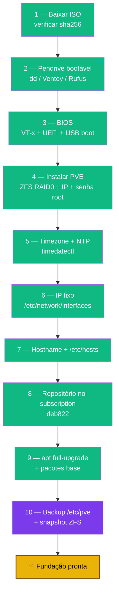

# Playbook 01 — Instalação + Fundação do Proxmox

**Objetivo:** Instalar o Proxmox VE 9 pela ISO e deixar a fundação pronta (IP fixo, NTP, repositórios, backup `/etc/pve`).
**Tempo:** ~3-5 h (com ISO já baixada: ~1 h)
**Pré-requisitos:**
- [ ] Mini PC (ex.: N5095, 16 GB RAM) com acesso físico
- [ ] Pendrive ≥ 8 GB
- [ ] Cabo Ethernet + acesso ao painel do roteador
- [ ] Bitwarden aberto para guardar a senha root

---

## Visão geral do processo



---

## 1 — Baixar a ISO e verificar

```bash
# No seu PC — versão mais recente em:
# https://www.proxmox.com/en/downloads/proxmox-virtual-environment/iso
sha256sum proxmox-ve_9.1-1.iso
# Compare com o sha256 publicado na página oficial ANTES de gravar
```

---

## 2 — Pendrive bootável

```bash
# Linux/macOS — CUIDADO: /dev/sdX apaga TUDO no pendrive (confira com lsblk)
sudo dd if=proxmox-ve_9.1-1.iso of=/dev/sdX bs=1M status=progress
sync
```

Windows: use **Ventoy** (copiar a ISO) ou **Rufus** (modo DD Image).

---

## 3 — Configurar BIOS

| Configuração | Valor |
|-------------|-------|
| Intel VT-x / AMD-V | **Habilitado** (obrigatório para VMs) |
| Boot Mode | **UEFI** |
| Secure Boot | Desabilitado (durante instalação) |
| Fast Boot | Desabilitado |
| Boot Order | USB primeiro |

---

## 4 — Instalar o Proxmox VE

No assistente gráfico:

```
Filesystem:      ZFS (RAID0)         ← recomendado homelab 1 disco
Hostname (FQDN): sentinela.local
IP Address:      192.168.1.100       ← o IP que vai fixar
Netmask:         255.255.255.0
Gateway:         192.168.1.1         ← IP do roteador
DNS:             1.1.1.1
```

Senha root **forte** (≥20 chars) → guardar **imediatamente** no Bitwarden.

Primeiro acesso:
```bash
# Browser: https://192.168.1.100:8006  (user root)
ssh root@192.168.1.100

# Verificar
pveversion          # pve-manager/9.x...
zpool list          # rpool (se ZFS)
ip addr show vmbr0  # IP configurado
```

---

## 5 — Timezone + NTP

```bash
timedatectl list-timezones | grep -i sao_paulo
timedatectl set-timezone America/Sao_Paulo   # ← seu timezone

timedatectl status
# Exigir: "System clock synchronized: yes" e "NTP service: active"
systemctl enable --now systemd-timesyncd
```

> NTP é obrigatório **antes** do 2FA — TOTP depende do relógio sincronizado.

---

## 6 — IP fixo

```bash
# Reserva no roteador (DHCP reservation) pelo MAC do Mini PC — fazer ANTES
ip addr show   # campo link/ether = MAC

# IP estático no Proxmox (tenha console físico!)
nano /etc/network/interfaces
```

Mudar `dhcp` para `static`:
```
auto vmbr0
iface vmbr0 inet static
    address 192.168.1.100/24
    gateway 192.168.1.1
    bridge-ports enp1s0
    bridge-stp off
    bridge-fd 0
    dns-nameservers 1.1.1.1 8.8.8.8
```

```bash
command -v ifreload >/dev/null || apt install -y ifupdown2
ifreload -a

# Verificar
ip -4 addr show vmbr0       # inet 192.168.1.100/24
ping -c 3 1.1.1.1
ping -c 3 google.com        # testa DNS
```

---

## 7 — Hostname + /etc/hosts

```bash
hostname -i           # deve retornar o IP do nó, NÃO 127.0.1.1
nano /etc/hosts
```

Garantir:
```
127.0.0.1 localhost
192.168.1.100 sentinela.local sentinela
::1 localhost ip6-localhost ip6-loopback
```

```bash
ping -c 1 "$(hostname)"   # deve pingar o IP real, não 127.0.0.1
```

---

## 8 — Repositório No-Subscription (deb822)

```bash
# No painel: nó → Updates → Repositories → desabilitar pve-enterprise
# (ou Enabled: no no .sources — NÃO comente com sed em deb822)

nano /etc/apt/sources.list.d/pve-no-subscription.sources
```

Colar:
```
Types: deb
URIs: http://download.proxmox.com/debian/pve
Suites: trixie
Components: pve-no-subscription
Signed-By: /usr/share/keyrings/proxmox-archive-keyring.gpg
```

```bash
apt update   # sem erros 401 Unauthorized
```

---

## 9 — Atualizar sistema + pacotes base

```bash
apt update && apt full-upgrade -y
apt install -y sudo curl wget nano gnupg ca-certificates git

# Se kernel atualizou:
needrestart -k -r i   # modo interativo (mais seguro)
# ou: reboot

pveversion              # pve-manager/9.x
cat /etc/debian_version # 13.x (Trixie)
```

---

## 10 — Backup `/etc/pve` + snapshot ZFS

```bash
mkdir -p /root/backups
tar czf /root/backups/etc-pve-fase0-$(date +%F).tar.gz /etc/pve/
ls -lh /root/backups/
```

Snapshot ZFS (confirme o dataset com `zfs list`):
```bash
zfs snapshot rpool/ROOT/pve-1@snap-fase0-instalacao-limpa
zfs list -t snapshot
```

> Copie o `.tar.gz` para fora do servidor (PC, OneDrive) após cada fase importante.

---

✅ **Concluído** — Proxmox instalado, rede fixa, repositórios corretos, primeiro backup feito.

**Próximo passo:** → [Playbook 02 — Identidade + SSH](./02-identidade-ssh.md)

📖 **Referência no curso:** [Fase -1](../🛡️%20Sentinela-Proxmox%20-%20Versão%201.0.md#fase-m1) · [Fase 0](../🛡️%20Sentinela-Proxmox%20-%20Versão%201.0.md#fase-0)
