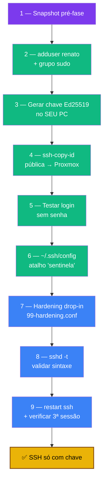

# Playbook 02 — Identidade + SSH

**Objetivo:** Criar usuário `renato` com sudo, login só por chave Ed25519 e hardening do SSH via drop-in.
**Tempo:** ~40 min
**Pré-requisitos:**
- [ ] Playbook 01 concluído (fundação pronta)
- [ ] Acesso root ao Proxmox
- [ ] **Duas sessões SSH abertas** durante o hardening (regra de ouro)

---

## Visão geral do processo



> ⚠️ **OpenSSH 10 no Debian 13 removeu DSA.** Use Ed25519. O serviço chama-se `ssh`, não `sshd`.

---

## 1 — Snapshot antes de começar

```bash
# Como root
zfs snapshot rpool/ROOT/pve-1@snap-pre-fase1
```

---

## 2 — Criar usuário renato + sudo

```bash
# Como root
adduser renato            # senha forte → Bitwarden
usermod -aG sudo renato   # -a append, -G grupo sudo
```

Verificar (**segundo terminal, não feche o root!**):
```bash
ssh renato@192.168.1.100
sudo whoami               # deve retornar: root
```

---

## 3 — Gerar chave Ed25519 (no SEU PC)

```bash
# No seu computador, NÃO no Proxmox
ssh-keygen -t ed25519 -C "renato-mini-pc" -f "$HOME/.ssh/chave_sentinela"
# Passphrase: recomendado forte → Bitwarden
```

Gera dois arquivos:
- `chave_sentinela` (privada — **nunca compartilhe**)
- `chave_sentinela.pub` (pública — pode distribuir)

---

## 4 — Enviar a chave pública

```bash
ssh-copy-id -i "$HOME/.ssh/chave_sentinela.pub" renato@192.168.1.100
# Pede a senha do renato pela última vez
```

---

## 5 — Testar login sem senha

```bash
ssh -i "$HOME/.ssh/chave_sentinela" renato@192.168.1.100
# Entrou pedindo só a passphrase local = sucesso
```

---

## 6 — Atalho no ~/.ssh/config (seu PC)

```bash
nano ~/.ssh/config
```

```
Host sentinela
    HostName 192.168.1.100
    User renato
    IdentityFile ~/.ssh/chave_sentinela
    IdentitiesOnly yes
```

Agora basta: `ssh sentinela`

---

## 7 — Hardening do SSH (drop-in)

> ⚠️ Mantenha 2 sessões SSH abertas durante esta etapa.

```bash
sudo nano /etc/ssh/sshd_config.d/99-hardening.conf
```

```
# Autenticação
PasswordAuthentication no
PubkeyAuthentication yes
PermitRootLogin no
PermitEmptyPasswords no

# Limites e timeouts
MaxAuthTries 3
LoginGraceTime 30
ClientAliveInterval 300
ClientAliveCountMax 2

# Reduzir superfície de ataque
X11Forwarding no
AllowAgentForwarding no
AllowTcpForwarding no

# PAM (necessário pro 2FA da Fase 3)
UsePAM yes
```

---

## 8 — Validar sintaxe ANTES de reiniciar

```bash
sudo sshd -t      # silêncio = OK. Erro = corrija antes de reiniciar
```

---

## 9 — Reiniciar e verificar

```bash
sudo systemctl restart ssh   # no Debian 13 é "ssh", não "sshd"
```

**Terceira sessão:**
```bash
ssh sentinela                # entra direto
ssh root@192.168.1.100       # deve dar: Permission denied (publickey)

sudo sshd -T | grep -E 'passwordauthentication|permitrootlogin|pubkeyauthentication|maxauthtries'
# passwordauthentication no / pubkeyauthentication yes / permitrootlogin no / maxauthtries 3
```

---

## 🆘 Se travou fora

Console físico ou `pve → Shell` no painel → logue como root → edite `/etc/ssh/sshd_config.d/99-hardening.conf` → `systemctl restart ssh`.

---

✅ **Concluído** — usuário sudo criado, SSH só com chave Ed25519, hardening aplicado.

**Próximo passo:** → [Playbook 03 — 2FA + CrowdSec](./03-2fa-crowdsec.md)

📖 **Referência no curso:** [Fase 1](../🛡️%20Sentinela-Proxmox%20-%20Versão%201.0.md#fase-1) · [Fase 2](../🛡️%20Sentinela-Proxmox%20-%20Versão%201.0.md#fase-2)
