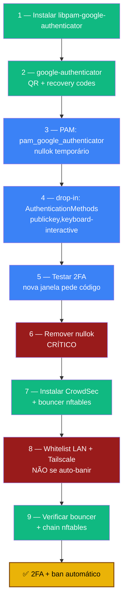

# Playbook 03 — 2FA no SSH + CrowdSec

**Objetivo:** Adicionar TOTP (2FA) ao login SSH e instalar o CrowdSec para banir IPs maliciosos automaticamente.
**Tempo:** ~1-2 h
**Pré-requisitos:**
- [ ] Playbook 02 concluído (SSH só com chave)
- [ ] App TOTP no celular (Aegis, Bitwarden, Google Authenticator)
- [ ] NTP sincronizado (Playbook 01) — TOTP depende do relógio
- [ ] **Sessão SSH aberta** + outra janela pronta para testar

---

## Visão geral do processo



> ⚠️ A partir daqui, **perder o celular = perder acesso.** Guarde os recovery codes no Bitwarden.

---

## 1 — Instalar módulo PAM

```bash
sudo zfs snapshot rpool/ROOT/pve-1@snap-pre-fase3
sudo apt install -y libpam-google-authenticator
```

---

## 2 — Configurar TOTP (como renato, SEM sudo)

```bash
google-authenticator
```

| Pergunta | Resposta |
|----------|----------|
| Time-based tokens? | **y** |
| Update the file? | **y** |
| Disallow multiple uses? | **y** |
| Increase time skew? | **n** |
| Enable rate-limiting? | **y** |

**Sem fechar o terminal:**
1. Escaneie o QR Code no app TOTP
2. Salve a chave secreta no Bitwarden
3. Salve os **5 recovery codes** no Bitwarden
4. Confirme que o código de 6 dígitos aparece

---

## 3 — Configurar PAM (nullok temporário)

```bash
sudo nano /etc/pam.d/sshd
```

No final do arquivo:
```
# 2FA TOTP via Google Authenticator
auth required pam_google_authenticator.so nullok
```

> `nullok` = permite logar sem 2FA configurado (temporário, removemos no passo 6).

---

## 4 — Exigir chave + 2FA (drop-in)

```bash
sudo nano /etc/ssh/sshd_config.d/99-hardening.conf
```

Adicionar no final:
```
# 2FA TOTP - requer chave + código
KbdInteractiveAuthentication yes
AuthenticationMethods publickey,keyboard-interactive
```

> ⚠️ **CRÍTICO:** use `KbdInteractiveAuthentication`. A antiga `ChallengeResponseAuthentication` foi **removida** no OpenSSH 10 — dá erro.

```bash
sudo sshd -t
sudo systemctl reload ssh || sudo systemctl restart ssh
```

---

## 5 — Testar 2FA (nova janela, NÃO feche a atual)

```bash
ssh sentinela
```

Esperado:
```
Authenticated using "publickey".
(renato@192.168.1.100) Verification code:
```

Digite o código do app. Entrou = ✅.

> Se **não** pedir código ou falhar: **não avance**. Reveja `/etc/pam.d/sshd`, o drop-in e `sudo sshd -T | grep -iE 'authenticationmethods|kbdinteractive'`.

---

## 6 — Remover nullok (CRÍTICO)

```bash
sudo nano /etc/pam.d/sshd
```

Mudar:
```
auth required pam_google_authenticator.so nullok
```
para (sem `nullok`):
```
auth required pam_google_authenticator.so
```

```bash
sudo sshd -t
sudo systemctl reload ssh || sudo systemctl restart ssh
```

---

## 7 — Instalar CrowdSec

```bash
sudo zfs snapshot rpool/ROOT/pve-1@snap-pre-fase4
curl -s https://install.crowdsec.net | sudo sh
sudo apt update
sudo apt install -y crowdsec crowdsec-firewall-bouncer-nftables
```

- `crowdsec` — cérebro que lê logs e detecta padrões
- `crowdsec-firewall-bouncer-nftables` — braço que bloqueia via nftables

---

## 8 — Whitelist (CRÍTICO — não se auto-banir)

```bash
sudo nano /etc/crowdsec/parsers/s02-enrich/whitelists.yaml
```

```yaml
name: my_whitelist
description: "Trusted internal networks"
whitelist:
  reason: "Rede local e Tailscale são confiáveis"
  ip:
    - "127.0.0.1"
  cidr:
    - "192.168.1.0/24"   # ajuste para sua rede (ip -4 addr show vmbr0)
    - "100.64.0.0/10"    # faixa completa do Tailscale
```

```bash
sudo systemctl restart crowdsec
sudo systemctl enable --now crowdsec-firewall-bouncer
```

---

## 9 — Verificar

```bash
sudo systemctl status crowdsec --no-pager              # active (running)
sudo systemctl status crowdsec-firewall-bouncer --no-pager
sudo cscli bouncers list                               # bouncer válido
sudo cscli collections list                            # linux, sshd...
sudo cscli decisions list                              # bans (pode estar vazio)
sudo nft list ruleset | grep -i crowdsec               # chain crowdsec presente
```

---

## 🆘 Se foi banido por engano

```bash
sudo cscli decisions list                    # ver IPs banidos
sudo cscli decisions delete --ip SEU_IP      # remover ban específico
sudo cscli decisions delete --all            # emergência: remover todos
```

> Código TOTP rejeitado mesmo correto? Relógio dessincronizado:
> `sudo timedatectl set-ntp true && sudo systemctl restart systemd-timesyncd`

---

✅ **Concluído** — login exige chave + código TOTP, e IPs maliciosos são banidos automaticamente.

**Próximo passo:** → [Playbook 04 — Tailscale + 2FA GUI](./04-tailscale-2fa-gui.md)

📖 **Referência no curso:** [Fase 3](../🛡️%20Sentinela-Proxmox%20-%20Versão%201.0.md#fase-3) · [Fase 4](../🛡️%20Sentinela-Proxmox%20-%20Versão%201.0.md#fase-4)
