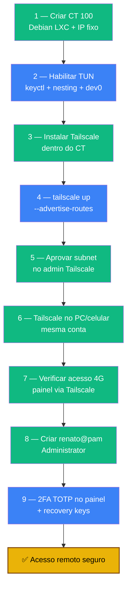

# Playbook 04 — Tailscale (acesso invisível) + 2FA no painel

**Objetivo:** Acesso remoto ao Proxmox sem abrir portas no roteador (Tailscale em LXC) e 2FA no painel web com `renato@pam`.
**Tempo:** ~1-2 h
**Pré-requisitos:**
- [ ] Playbook 03 concluído (2FA SSH + CrowdSec)
- [ ] Conta Tailscale (Google/GitHub) + app no PC e celular
- [ ] Template `debian-13-standard` baixado no Proxmox

---

## Visão geral do processo



> ⚠️ **Nunca ative "Tailscale SSH" no Admin Console** — ele bypassa o TOTP+chave das fases anteriores. Use SSH regular tunelado pela rede Tailscale.

---

## 1 — Criar o Container LXC (CT 100)

No painel → **Create CT**:

| Campo | Valor |
|-------|-------|
| CT ID | `100` |
| Hostname | `vpn-tailscale` |
| Password | senha forte → Bitwarden |
| SSH key | cole sua chave pública |
| Template | `debian-13-standard` |
| Disk | `4` GB |
| Cores | `1` |
| Memory | `512` MB (⚠️ não use 256) |
| IPv4 | `Static` → `192.168.1.110/24` |
| Gateway | `192.168.1.1` |
| DNS | `1.1.1.1 8.8.8.8` |
| Start after created | ✅ |

---

## 2 — Habilitar TUN (no host PVE)

```bash
sudo zfs snapshot rpool/ROOT/pve-1@snap-pre-fase5
sudo pct stop 100
sudo pct set 100 --features keyctl=1,nesting=1
sudo pct set 100 --dev0 /dev/net/tun
sudo pct start 100
```

> Sem isso o Tailscale cai em modo userspace (desempenho ruim).

---

## 3 — Instalar Tailscale (console do CT 100, como root)

```bash
# Confirmar rede e DNS primeiro
ping -c 2 1.1.1.1 && echo "Rede OK"
ping -c 1 -W 3 tailscale.com && echo "DNS OK"

apt update && apt install -y curl
curl -fsSL https://tailscale.com/install.sh | sh

ls -l /dev/net/tun   # crw-rw-rw- ... 10, 200
```

---

## 4 — Subir Tailscale com subnet routing

```bash
tailscale up --advertise-routes=192.168.1.0/24 --accept-routes
# Abra o link de login, autentique no navegador

# Confirmar IP forwarding (após login)
sysctl net.ipv4.ip_forward net.ipv6.conf.all.forwarding
```

Se `ip_forward = 0`, aplicar:
```bash
echo 'net.ipv4.ip_forward = 1' | tee /etc/sysctl.d/99-sentinela-tailscale-forward.conf
echo 'net.ipv6.conf.all.forwarding = 1' | tee -a /etc/sysctl.d/99-sentinela-tailscale-forward.conf
sysctl -p /etc/sysctl.d/99-sentinela-tailscale-forward.conf
```

---

## 5 — Aprovar a subnet route

`https://login.tailscale.com/admin/machines`:
1. Encontre `vpn-tailscale`
2. **⋯ → Edit route settings**
3. Marque ✅ `192.168.1.0/24` → **Save**

---

## 6 — Tailscale no PC e celular

- PC: https://tailscale.com/download
- Celular: Play Store / App Store
- Logue com a **mesma conta**

Acesso SSH pelo celular (Termius via 4G):
```bash
# Descobrir IP Tailscale do servidor
sudo pct exec 100 -- tailscale ip -4   # ex: 100.84.23.115
# Termius: Host = esse IP, Port 22, User renato, Auth = chave → pede TOTP
```

---

## 7 — Verificar acesso remoto

```bash
# No CT 100
tailscale status
tailscale ip
ip addr show tailscale0   # interface com IP 100.x.x.x

# No PC/celular com Tailscale ativo (mesmo via 4G):
# https://192.168.1.100:8006  deve carregar
```

---

## 8 — Criar renato@pam (painel web)

Logue como `root@pam` pela última vez:

1. **Datacenter → Permissions → Users → Add**
   - User: `renato` · Realm: `Linux PAM` · Enabled ✅
2. **Datacenter → Permissions → Add → User Permission**
   - Path: `/` · User: `renato@pam` · Role: `Administrator` · Propagate ✅

---

## 9 — 2FA TOTP no painel + recovery keys

Logue como `renato@pam`:

1. Canto superior direito (`renato@pam`) → **TFA**
2. **Add → TOTP** → descrição `Celular Renato` → escaneie QR → digite código → **Add**
3. **Add → Recovery Keys** → salve TODAS no Bitwarden

> O 2FA do painel é **separado** do 2FA do SSH — configure de novo.

Verificar: logout → logue como `renato@pam` → deve pedir senha + TOTP.

---

## 🆘 Se deu errado

| Erro | Solução |
|------|---------|
| `tstun.New: operation not permitted` | Repita `pct set 100 --dev0 /dev/net/tun` com CT parado |
| Conecta Tailscale mas não vê `192.168.1.100` | Aprovar subnet (passo 5) + checar `sysctl ip_forward` |

---

✅ **Concluído** — acesso remoto sem port forwarding + painel com 2FA.

**Próximo passo:** → [Playbook 05 — Firewall nftables](./05-firewall-nftables.md)

📖 **Referência no curso:** [Fase 5](../🛡️%20Sentinela-Proxmox%20-%20Versão%201.0.md#fase-5) · [Fase 6](../🛡️%20Sentinela-Proxmox%20-%20Versão%201.0.md#fase-6)
