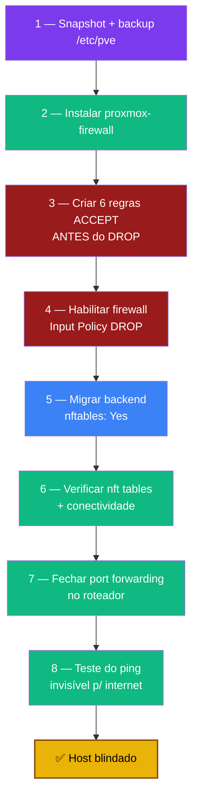

# Playbook 05 — Firewall nftables (proxmox-firewall)

**Objetivo:** Migrar para o backend `nftables` do Proxmox 9, deixar o host invisível para a internet e fechar o port forwarding do roteador.
**Tempo:** ~1-2 h
**Pré-requisitos:**
- [ ] Playbook 04 concluído (Tailscale ativo — é por ele que você acessa após o DROP)
- [ ] Acesso ao painel + console físico/web disponível (caso se tranque)

---

## Visão geral do processo



> ⚠️ **SEMPRE crie as regras ACCEPT antes de mudar para DROP** — senão você se tranca fora.

---

## 1 — Snapshot + backup

```bash
sudo zfs snapshot rpool/ROOT/pve-1@snap-pre-fase7
sudo tar czf /root/backups/etc-pve-fase7-$(date +%F).tar.gz /etc/pve/
```

---

## 2 — Instalar proxmox-firewall

```bash
sudo apt install -y proxmox-firewall   # geralmente já vem no PVE 9.x
```

---

## 3 — Criar 6 regras ACCEPT (ANTES do DROP)

**Datacenter → Firewall → Rules → Add** — crie e marque **Enable** em cada:

| Direction | Action | Source | Dest. port | Protocol | Comment |
|-----------|--------|--------|------------|----------|---------|
| in | ACCEPT | `100.64.0.0/10` | `22` | tcp | SSH via Tailscale |
| in | ACCEPT | `100.64.0.0/10` | `8006` | tcp | Web GUI via Tailscale |
| in | ACCEPT | `192.168.1.0/24` | `22` | tcp | SSH LAN (emergência) |
| in | ACCEPT | `192.168.1.0/24` | `8006` | tcp | Web GUI LAN (emergência) |
| in | ACCEPT | `100.64.0.0/10` | — | icmp | Ping via Tailscale |
| in | ACCEPT | `192.168.1.0/24` | — | icmp | Ping LAN |

> As 2 regras ICMP mantêm o host pingável por **você** (LAN+Tailscale) mas invisível para a internet.

---

## 4 — Habilitar o firewall

**Datacenter → Firewall → Options → Edit:**
- Firewall: **Yes**
- Input Policy: **DROP**
- Output Policy: **ACCEPT**
- Log level in: **info**

**Nó → Firewall → Options → Edit:**
- Firewall: **Yes**

---

## 5 — Migrar para backend nftables

**Nó → Firewall → Options → Edit:**
- nftables: **Yes**

> Tech preview. Após alternar, reinicie VMs/CTs para o novo firewall atuar de forma consistente (janela curta de manutenção).

---

## 6 — Verificar

```bash
sudo systemctl status proxmox-firewall --no-pager     # active (running)

sudo nft list tables
# table inet proxmox-firewall
# table bridge proxmox-firewall-guests
# table inet crowdsec (do bouncer)

sudo nft list ruleset | head -50

# Confirmar que não há 2 camadas (PVEFW = pve-firewall clássico ainda ativo)
sudo iptables -L 2>/dev/null | grep -q "PVEFW" && echo "ATENCAO: PVEFW presente" || echo "OK nft-only"
```

Teste de conectividade:
```bash
ssh sentinela                  # via Tailscale — deve funcionar
ssh renato@192.168.1.100       # via LAN — deve funcionar
```

---

## 7 — Fechar port forwarding no roteador

No painel do roteador, remova:
- Port Forwarding / NAT (especialmente portas 22 e 8006)
- DMZ
- UPnP apontando para o Mini PC

---

## 8 — Teste do ping (invisibilidade)

| De onde | Para | Esperado |
|---------|------|----------|
| Seu PC (LAN) | `ping 192.168.1.100` | ✅ Responde |
| Tailscale client | `ping sentinela` | ✅ Responde |
| Celular 4G | `ping IP_PUBLICO` | ❌ Timeout |
| Scanner externo | porta 22/8006/ICMP | ❌ DROP |

```bash
sudo nft list ruleset | grep -A3 icmp   # bloco icmp accept p/ as 2 sub-redes
ping -c 3 192.168.1.100                  # da LAN: responde
```

> Servidor invisível para a internet, visível só para você. Tailscale/ShellHub funcionam porque fazem conexão de **saída** — não dependem de portas abertas.

---

## 🆘 Se você se trancou fora

Console físico ou `pve → Shell`:
```bash
sudo systemctl stop proxmox-firewall
sudo systemctl stop pve-firewall
sudo pve-firewall stop
# Editar /etc/pve/firewall/cluster.fw → [OPTIONS] enable: 1 → enable: 0
```

Diagnóstico do serviço:
```bash
sudo journalctl -u proxmox-firewall -n 50 --no-pager
```

---

✅ **Concluído** — firewall nftables com DROP, host invisível para internet, port forwarding removido.

**Próximo passo:** → [Playbook 06 — Lab ShellHub + GPG](./06-lab-shellhub-gpg.md)

📖 **Referência no curso:** [Fase 7](../🛡️%20Sentinela-Proxmox%20-%20Versão%201.0.md#fase-7)
