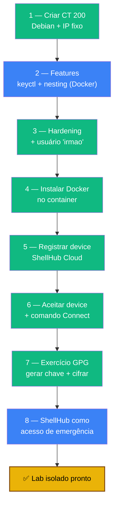

# Playbook 06 — Lab isolado: ShellHub + GPG

**Objetivo:** Criar um CT isolado (CT 200) com Docker + ShellHub para um terceiro estudar GPG, sem expor sua rede — e ter um canal de acesso de emergência.
**Tempo:** ~60-90 min
**Pré-requisitos:**
- [ ] Playbook 05 concluído (firewall ativo)
- [ ] Conta gratuita em https://cloud.shellhub.io
- [ ] Template `debian-13-standard` no Proxmox

---

## Visão geral do processo



> ShellHub usa túnel reverso (o CT liga para a nuvem) — não abre nenhuma porta no roteador.

---

## 1 — Criar CT 200

```bash
sudo zfs snapshot rpool/ROOT/pve-1@snap-pre-fase8
```

**Create CT:**

| Campo | Valor |
|-------|-------|
| CT ID | `200` |
| Hostname | `lab-irmao-gpg` |
| Password | senha forte → Bitwarden |
| Template | `debian-13-standard` |
| Disk | `10` GB · Cores `1` · Memory `1024` MB · Swap `512` MB |
| IPv4 | Static `192.168.1.120/24`, GW `192.168.1.1`, DNS `1.1.1.1` |
| Tags | `lab`, `irmao` |
| Unprivileged | ✅ |

---

## 2 — Habilitar features para Docker

```bash
sudo pct stop 200
sudo pct set 200 --features keyctl=1,nesting=1
sudo pct start 200
```

---

## 3 — Hardening dentro do container (console CT 200, root)

```bash
apt update && apt full-upgrade -y
apt install -y sudo gnupg curl nano ca-certificates

adduser irmao
usermod -aG sudo irmao
```

---

## 4 — Instalar Docker

```bash
curl -fsSL https://get.docker.com | sh   # ou: apt install docker.io
systemctl enable --now docker
docker --version
docker run hello-world
```

---

## 5 — Registrar no ShellHub Cloud

1. Conta gratuita em https://cloud.shellhub.io
2. **Devices → Add Device**
3. Copie o comando de instalação → cole no console do CT 200
4. Volte ao painel → device em **Pending** → **Accept**

---

## 6 — Como o terceiro acessa

No painel ShellHub, **Connect** ao lado do device:
```
ssh irmao@SSHID.shellhub.io
```
Mande esse comando — ele cola no terminal e cai direto no CT.

---

## 7 — Exercício GPG (pedagógico)

No CT, como `irmao`:
```bash
gpg --full-generate-key
# Escolha ECC (Curve25519/Ed25519) se disponível; validade 1y; nome + email

gpg --armor --export irmao@email.com > irmao.pub
cat irmao.pub   # manda o bloco pra você
```

Você importa e cifra:
```bash
nano irmao.pub          # cole o conteúdo
gpg --import irmao.pub
gpg --list-keys

echo "Bem-vindo ao lab!" | gpg --encrypt --armor -r irmao@email.com > msg.asc
cat msg.asc             # manda pra ele
```

Ele decifra:
```bash
nano msg.asc            # cola, salva
gpg --decrypt msg.asc
```

🎉 Criptografia assimétrica na prática.

---

## 8 — ShellHub como acesso de emergência

Se o Tailscale cair ou você perder o app TOTP, o CT 200 vira canal de último recurso:

```bash
# No painel ShellHub Cloud → Connect ao CT 200 → shell Debian no CT
# De lá, SSH para o host pela LAN interna:
ssh renato@192.168.1.100
```

> Quando usar: Tailscale (CT 100) caiu, app 2FA perdido, PC sem LAN. ShellHub Cloud é o "arrombador" via browser. Proteja a conta ShellHub com 2FA (app.shellhub.io).

---

✅ **Concluído** — lab GPG isolado com Docker + ShellHub, e um canal de emergência extra.

**Próximo passo:** → [Playbook 07 — Manutenção](./07-manutencao.md)

📖 **Referência no curso:** [Fase 8](../🛡️%20Sentinela-Proxmox%20-%20Versão%201.0.md#fase-8)
