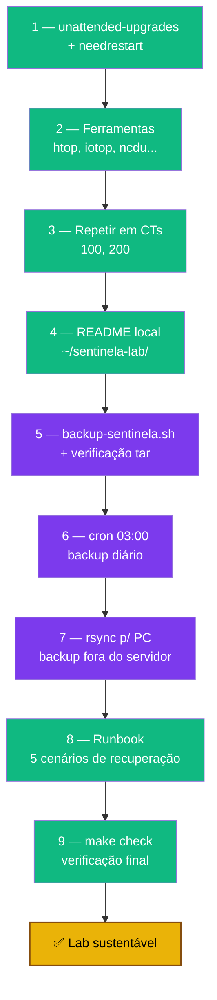

# Playbook 07 — Manutenção automática + documentação viva

**Objetivo:** Atualizações de segurança automáticas, ferramentas de observabilidade e os 3 artefatos de documentação (README, diário, runbook) + backup `/etc/pve` agendado.
**Tempo:** ~50-75 min
**Pré-requisitos:**
- [ ] Playbook 06 concluído (lab + emergência)
- [ ] Acesso `renato` com sudo

---

## Visão geral do processo



---

## 1 — Atualizações automáticas

```bash
sudo zfs snapshot rpool/ROOT/pve-1@snap-pre-fase9
sudo apt install -y unattended-upgrades needrestart apt-listchanges
sudo dpkg-reconfigure --priority=low unattended-upgrades   # Yes

grep -A 12 'Unattended-Upgrade::Allowed-Origins' /etc/apt/apt.conf.d/50unattended-upgrades
```

> ⚠️ **needrestart:** não copie receitas `sed` que mudam `$nrconf{restart}` para `'a'` (reinício automático) sem entender — pode reiniciar serviços sem avisar durante acesso remoto. Trate `full-upgrade` como manutenção (2 sessões SSH ou console físico).

---

## 2 — Ferramentas de observabilidade

```bash
sudo apt install -y htop iotop iftop ncdu tree
```

| Comando | Para que serve |
|---------|----------------|
| `htop` | CPU/RAM/processos |
| `iotop` | Quem usa o disco |
| `iftop` | Tráfego de rede |
| `ncdu` | O que ocupa espaço |

---

## 3 — Repetir em cada CT/VM

```bash
# Dentro de cada CT (100, 200, e futuros), console como root:
apt update && apt install -y unattended-upgrades
dpkg-reconfigure --priority=low unattended-upgrades
```

---

## 4 — README local

```bash
mkdir -p ~/sentinela-lab
cat > ~/sentinela-lab/README.md << 'EOF'
# Sentinela Proxmox — Estado Atual

## Rede
- IP local: 192.168.1.100/24 · GW 192.168.1.1 · DNS 1.1.1.1
- Tailscale IP: (preencher)

## Containers
| ID  | Nome          | IP            | Função              |
|-----|---------------|---------------|---------------------|
| 100 | vpn-tailscale | 192.168.1.110 | VPN + subnet        |
| 200 | lab-irmao-gpg | 192.168.1.120 | Lab GPG             |

## Segurança Ativa
- SSH: Ed25519 + 2FA TOTP · root SSH bloqueado
- Painel: senha + 2FA TOTP
- CrowdSec + bouncer nftables
- proxmox-firewall (nftables) em DROP
- Acesso externo: só Tailscale · port forwarding DESATIVADO
EOF
cat ~/sentinela-lab/README.md
```

---

## 5 — Script de backup `/etc/pve`

```bash
sudo nano /usr/local/bin/backup-sentinela.sh
```

```bash
#!/bin/bash
set -e
DATE=$(date +%F-%H%M)
BACKUP_DIR="/root/backups"
mkdir -p "$BACKUP_DIR"
tar czf "$BACKUP_DIR/etc-pve-$DATE.tar.gz" /etc/pve/
tar tzf "$BACKUP_DIR/etc-pve-$DATE.tar.gz" >/dev/null && echo "OK: tar legível"
# Manter só os últimos 30
ls -t "$BACKUP_DIR"/etc-pve-*.tar.gz | tail -n +31 | xargs -r rm
echo "Backup OK: $BACKUP_DIR/etc-pve-$DATE.tar.gz"
```

```bash
sudo chmod +x /usr/local/bin/backup-sentinela.sh
sudo /usr/local/bin/backup-sentinela.sh
```

---

## 6 — Agendar backup diário (cron)

```bash
sudo crontab -e
```
```
# Backup diário às 03:00
0 3 * * * /usr/local/bin/backup-sentinela.sh >> /var/log/backup-sentinela.log 2>&1
```

> Alternativa systemd (`.timer` + `.service`): ver `scripts/systemd/` no repo.

---

## 7 — Copiar backups para fora (no seu PC)

```bash
nano ~/sync-sentinela-backups.sh
```
```bash
#!/bin/bash
rsync -avz --delete sentinela:/root/backups/ ~/sentinela-backups/
```
```bash
chmod +x ~/sync-sentinela-backups.sh
~/sync-sentinela-backups.sh   # rode 1x/semana ou agende cron no PC
```

> ⚠️ Backup que fica só no servidor não é backup.

---

## 8 — Runbook de recuperação

```bash
cat > ~/sentinela-lab/recuperacao.md << 'EOF'
# Plano de Recuperação — Sentinela Proxmox

## 1: Perdi acesso SSH
- Console físico → root (Bitwarden) → systemctl status ssh
- Config quebrada → comentar linhas → sudo systemctl restart ssh

## 2: Perdi o celular 2FA
- Usar recovery code do Bitwarden → reconfigurar google-authenticator

## 3: Mini PC/disco morreu
- Reinstalar PVE 9 → mesma rede → sudo tar xzf etc-pve-DATE.tar.gz -C /
- Reconfigurar Tailscale (re-autenticar)

## 4: Auto-ban CrowdSec
- Console → sudo cscli decisions delete --ip MEU_IP (ou --all)

## 5: Firewall me trancou fora
- Console → sudo systemctl stop proxmox-firewall pve-firewall
- /etc/pve/firewall/cluster.fw → enable: 0 → corrigir → enable: 1
EOF
cat ~/sentinela-lab/recuperacao.md
```

---

## 9 — Verificação final

```bash
sudo bash scripts/sentinela-health-check.sh --verbose
# ou, se clonou o repo no host:
cd ~/sentinela-lab && make check
```

Resultado esperado: tudo verde ✅. Vermelho ❌ = resolver antes de considerar "em produção".

---

✅ **Concluído** — atualizações automáticas, documentação viva, backup `/etc/pve` agendado e copiado para fora.

**Próximo passo:** → [Playbook 08 — Backup vzdump](./08-backup-vzdump.md)

📖 **Referência no curso:** [Fase 9](../🛡️%20Sentinela-Proxmox%20-%20Versão%201.0.md#fase-9) · [Fase 10](../🛡️%20Sentinela-Proxmox%20-%20Versão%201.0.md#fase-10)
