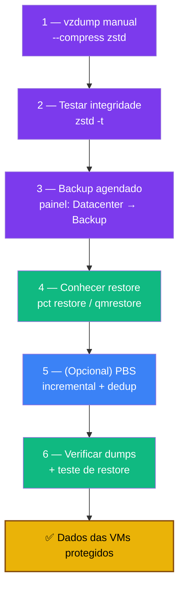

# Playbook 08 — Backup de VMs e CTs (vzdump + PBS)

**Objetivo:** Configurar backups automáticos do **conteúdo** das VMs/CTs (não só a config do nó) com `vzdump`, e conhecer o caminho para o Proxmox Backup Server.
**Tempo:** ~30-45 min
**Pré-requisitos:**
- [ ] Playbook 07 concluído (backup `/etc/pve` já agendado)
- [ ] Pelo menos um CT/VM criado (ex.: CT 100, 200)
- [ ] Espaço em disco para os dumps (`df -h`)

---

## Visão geral do processo



> `/etc/pve` (Playbook 07) protege a **config** do nó. `vzdump` protege o **conteúdo** das VMs/CTs.

---

## 1 — Backup manual com vzdump

```bash
# Como root — listar o que existe
pct list       # containers LXC
qm list        # VMs

# Backup de um CT para o storage local (/var/lib/vz/dump/)
vzdump 100 --compress zstd --storage local

# Backup de uma VM
vzdump 101 --compress zstd --storage local

ls -lh /var/lib/vz/dump/
# vzdump-lxc-100-2026_05_12-03_00_00.tar.zst
```

> `--compress zstd` = mais rápido que gzip com melhor compressão.

---

## 2 — Testar integridade

```bash
zstd -t /var/lib/vz/dump/vzdump-lxc-100-*.tar.zst
# Saída esperada: OK
```

---

## 3 — Backup agendado (painel web)

1. **Datacenter → Backup → Add**
2. Configure:
   - **Storage:** `local`
   - **Schedule:** `00:03` (diário) ou `sun 03:00` (semanal)
   - **Selection:** `All` ou selecione VMs/CTs
   - **Compression:** `ZSTD`
   - **Mode:** `Snapshot` (VMs c/ QEMU Agent) ou `Suspend` (CTs)
   - **Max Backups:** `3` (ajuste ao espaço)
3. **Create** → pode clicar **Run now** para testar

---

## 4 — Restaurar (referência)

```bash
# Restaurar CT (substitua VMID e caminho)
pct restore 100 /var/lib/vz/dump/vzdump-lxc-100-*.tar.zst \
  --storage local-lvm --unprivileged 1

# Restaurar VM
qmrestore /var/lib/vz/dump/vzdump-qemu-101-*.vma.zst 101 --storage local-lvm

# Ou painel: Storage → local → Backups → selecionar → Restore
```

> ⚠️ Restaurar por cima de um VMID existente **substitui** a VM/CT. Para testar em paralelo, use VMID diferente (`pct restore 250 ...`).

---

## 5 — (Opcional) Proxmox Backup Server

Vantagens sobre vzdump local: backups incrementais, deduplicação, verificação automática de integridade, interface web própria.

```bash
# Após instalar o PBS (VM, 2º mini PC, Pi ou NAS):
# PVE → Datacenter → Storage → Add → Proxmox Backup Server
# (ID, Server IP, Datastore, credenciais)

vzdump 100 --storage pbs-storage --compress zstd
proxmox-backup-client list   # no nó PBS
```

> Instalação do zero: https://pbs.proxmox.com/docs/installation.html

---

## 6 — Verificar

```bash
ls -lh /var/lib/vz/dump/

# Testar integridade de todos os dumps
for f in /var/lib/vz/dump/*.tar.zst; do
  zstd -t "$f" && echo "OK: $f" || echo "ERRO: $f"
done

# Painel: Datacenter → Backup → ver agendamento e histórico
```

> **Teste de restore antes de confiar:** restaure um CT num VMID novo e confirme que sobe. Backup não testado = backup que não existe.

---

## 🆘 Se deu errado

| Sintoma | Solução |
|---------|---------|
| `unable to freeze CT` | Use `--mode suspend` em vez de `snapshot` |
| Espaço insuficiente | Reduza `Max Backups` ou use storage externo (USB/NFS) |
| `zstd: Corrupted block` | Delete e refaça; cheque `df -h` antes |
| PBS não aparece como storage | `pvecm updatecerts` ou adicione fingerprint do PBS |

---

✅ **Concluído** — VMs e CTs com backup automático testado. A matriz 3-2-1-1-0 do conteúdo está coberta.

**Próximo passo:** → [Playbook 09 — Health check + monitoramento](./09-health-check.md)

📖 **Referência no curso:** [Fase 10b](../🛡️%20Sentinela-Proxmox%20-%20Versão%201.0.md#fase-10b)
