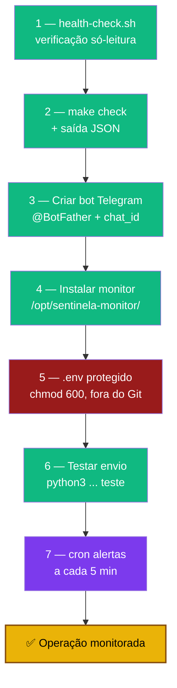

# Playbook 09 — Health check + monitoramento Telegram

**Objetivo:** Verificação só-leitura do host (`sentinela-health-check.sh`) e alertas no celular via Telegram, sem Prometheus/Grafana.
**Tempo:** ~30-45 min
**Pré-requisitos:**
- [ ] Playbooks 01-08 concluídos (lab endurecido)
- [ ] Repositório clonado no host (ou scripts copiados via scp)
- [ ] Para Telegram: conta + bot criado no @BotFather

---

## Visão geral do processo



---

## 1 — Health check (só-leitura)

```bash
# No host, como renato com sudo
sudo bash scripts/sentinela-health-check.sh
sudo bash scripts/sentinela-health-check.sh --verbose
```

Verifica: NTP, serviço `ssh`, `sshd -T` (password/root), `pveversion`, disco `/`, ZFS, último backup `etc-pve-*.tar.gz`, CrowdSec + bouncer + `proxmox-firewall`, CTs 100/200.

Saída verde/amarelo/vermelho. Exit `0` = sem falhas críticas; `1` = pelo menos uma falha.

---

## 2 — make check + JSON (para agendadores)

```bash
cd ~/sentinela-lab          # ou onde clonou o repo
make check                  # saída amigável
make check-json             # {"failures":N,"warnings":M,"ok":true}

# JSON direto (útil em cron/CI):
sudo bash scripts/sentinela-health-check.sh --json
```

---

## 3 — Criar bot Telegram + chat_id

1. No Telegram, fale com **@BotFather** → `/newbot` → copie o **token**
2. Mande qualquer mensagem ao seu novo bot
3. Descubra o chat_id:
```bash
curl -s "https://api.telegram.org/bot<SEU_TOKEN>/getUpdates"
# Procure "chat":{"id": NNN} — esse NNN é o TELEGRAM_CHAT_ID
```

Confirme que o host sai para a internet (HTTPS):
```bash
curl -sS -o /dev/null -w "%{http_code}\n" https://api.telegram.org/   # 200 ou 302
```

---

## 4 — Instalar o monitor

```bash
sudo apt install -y python3 python3-requests
sudo mkdir -p /opt/sentinela-monitor

sudo cp scripts/sentinela-telegram-monitor.py /opt/sentinela-monitor/
sudo chmod 700 /opt/sentinela-monitor/sentinela-telegram-monitor.py
sudo chown root:root /opt/sentinela-monitor/sentinela-telegram-monitor.py
```

---

## 5 — Arquivo .env protegido (CRÍTICO — fora do Git)

```bash
sudo install -m 600 /dev/null /etc/sentinela-monitor.env
sudo nano /etc/sentinela-monitor.env
```

```
TELEGRAM_BOT_TOKEN=123456:ABC-DEF...
TELEGRAM_CHAT_ID=123456789
```

```bash
sudo chmod 600 /etc/sentinela-monitor.env
sudo chown root:root /etc/sentinela-monitor.env
```

> ⚠️ **Nunca** versionar tokens nem `.env` no Git. Duplique no Bitwarden (pasta Sentinela).

---

## 6 — Testar envio

```bash
sudo set -a; source /etc/sentinela-monitor.env; set +a
sudo -E python3 /opt/sentinela-monitor/sentinela-telegram-monitor.py teste
# Deve chegar uma mensagem no seu Telegram
```

---

## 7 — Agendar alertas (cron de root)

```bash
sudo crontab -e
```

```cron
# Alertas a cada 5 minutos (RAM, disco, VMs caídas, digest CrowdSec)
*/5 * * * * set -a; . /etc/sentinela-monitor.env; set +a; /usr/bin/python3 /opt/sentinela-monitor/sentinela-telegram-monitor.py alertas >> /var/log/sentinela-monitor.log 2>&1
```

> Alternativa systemd (long polling para comandos `/status`, `/vms`): ver `scripts/` e a doc `docs/monitoramento-telegram.md`.

---

## Rotina de operação contínua

| Frequência | Ação |
|-----------|------|
| Contínuo | Alertas Telegram (cron 5 min) |
| Semanal | `make check` manual + revisar `cscli decisions list` |
| Mensal | Testar restore de um CT (Playbook 08) + revisar diário |
| A cada mudança | Snapshot ZFS + entrada no `~/sentinela-lab/diario.md` |

---

✅ **Concluído** — host com verificação só-leitura sob demanda e alertas no celular. Lab Sentinela completo e monitorado.

**Volte ao início:** → [Playbook 01 — Instalação + Fundação](./01-instalacao-fundacao.md) · [README dos playbooks](./README.md)

📖 **Referência no curso:** [scripts/README.md](../scripts/README.md) · [docs/monitoramento-telegram.md](../docs/monitoramento-telegram.md) · [Fase 4](../🛡️%20Sentinela-Proxmox%20-%20Versão%201.0.md#fase-4)
