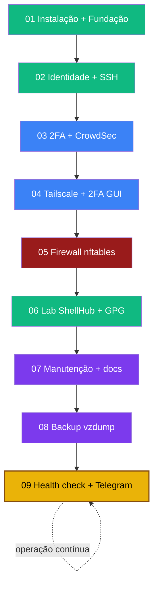

# 🛡️ Playbooks — Sentinela Proxmox VE 9

**Execução direta. Zero teoria. Copie e cole.**

Cada arquivo = um procedimento completo, do zero ao "funcionou".
Cada playbook começa com um **diagrama "Visão geral do processo"** — olhe antes de executar.
Para entender *por quê* cada passo existe → [curso principal](../🛡️%20Sentinela-Proxmox%20-%20Versão%201.0.md) (link no rodapé de cada playbook).

---

## Trilha completa — ordem recomendada

| # | Playbook | Fases | O que você terá ao final | Tempo |
|---|----------|-------|--------------------------|------:|
| [01](./01-instalacao-fundacao.md) | Instalação + Fundação | -1, 0 | PVE instalado, IP fixo, repos, backup `/etc/pve` | ~3-5 h |
| [02](./02-identidade-ssh.md) | Identidade + SSH | 1, 2 | Usuário sudo, login só com chave Ed25519 | ~40 min |
| [03](./03-2fa-crowdsec.md) | 2FA + CrowdSec | 3, 4 | TOTP no SSH + ban automático de IPs | ~1-2 h |
| [04](./04-tailscale-2fa-gui.md) | Tailscale + 2FA painel | 5, 6 | Acesso remoto sem port forward + 2FA GUI | ~1-2 h |
| [05](./05-firewall-nftables.md) | Firewall nftables | 7 | Host invisível p/ internet, DROP por padrão | ~1-2 h |
| [06](./06-lab-shellhub-gpg.md) | Lab ShellHub + GPG | 8 | CT isolado + canal de emergência | ~60-90 min |
| [07](./07-manutencao.md) | Manutenção + docs | 9, 10 | Updates automáticos, runbook, backup agendado | ~50-75 min |
| [08](./08-backup-vzdump.md) | Backup vzdump | 10b | VMs/CTs com backup testado | ~30-45 min |
| [09](./09-health-check.md) | Health check + Telegram | operação | Verificação só-leitura + alertas no celular | ~30-45 min |

> **Ordem importa** — não pule fases críticas de rede, SSH ou firewall. O firewall (05) só é seguro depois do Tailscale (04).

---

## Mapa de dependências



---

## Estrutura de cada playbook

```
# Título
Objetivo · Tempo · Pré-requisitos
---
## Visão geral do processo   ← diagrama Mermaid do fluxo completo
## 1 — Passo 1               ← comandos, sem teoria
...
✅ Concluído                  ← próximo passo + referência no curso
```

---

## Correlação playbook → fase do curso

| Playbook | Âncora no curso |
|----------|----------------|
| 01 | [#fase-m1](../🛡️%20Sentinela-Proxmox%20-%20Versão%201.0.md#fase-m1) · [#fase-0](../🛡️%20Sentinela-Proxmox%20-%20Versão%201.0.md#fase-0) |
| 02 | [#fase-1](../🛡️%20Sentinela-Proxmox%20-%20Versão%201.0.md#fase-1) · [#fase-2](../🛡️%20Sentinela-Proxmox%20-%20Versão%201.0.md#fase-2) |
| 03 | [#fase-3](../🛡️%20Sentinela-Proxmox%20-%20Versão%201.0.md#fase-3) · [#fase-4](../🛡️%20Sentinela-Proxmox%20-%20Versão%201.0.md#fase-4) |
| 04 | [#fase-5](../🛡️%20Sentinela-Proxmox%20-%20Versão%201.0.md#fase-5) · [#fase-6](../🛡️%20Sentinela-Proxmox%20-%20Versão%201.0.md#fase-6) |
| 05 | [#fase-7](../🛡️%20Sentinela-Proxmox%20-%20Versão%201.0.md#fase-7) |
| 06 | [#fase-8](../🛡️%20Sentinela-Proxmox%20-%20Versão%201.0.md#fase-8) |
| 07 | [#fase-9](../🛡️%20Sentinela-Proxmox%20-%20Versão%201.0.md#fase-9) · [#fase-10](../🛡️%20Sentinela-Proxmox%20-%20Versão%201.0.md#fase-10) |
| 08 | [#fase-10b](../🛡️%20Sentinela-Proxmox%20-%20Versão%201.0.md#fase-10b) |
| 09 | [scripts/README.md](../scripts/README.md) · [docs/monitoramento-telegram.md](../docs/monitoramento-telegram.md) |

---

*Sentinela Proxmox VE 9 · VIPs-com · curso completo: [🛡️ Sentinela-Proxmox - Versão 1.0.md](../🛡️%20Sentinela-Proxmox%20-%20Versão%201.0.md)*
